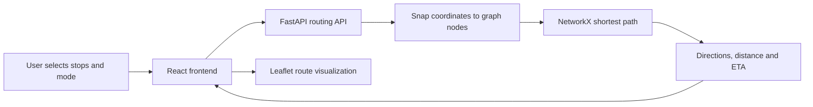

# IITK Navigator Pro

**A graph-based, multi-modal campus navigation system for IIT Kanpur built with OpenStreetMap data.**

[](https://iitk-campus-navigator.vercel.app/)

IITK Navigator Pro provides campus-specific walking, cycling, and driving routes. It uses separate OpenStreetMap road networks to reach internal campus destinations that conventional navigation platforms may miss.

## Key Features

- Walking, cycling, and driving route modes
- Campus landmark search and map-based point selection
- Multi-stop routes with up to five locations
- Human-readable turn-by-turn directions
- Route distance and estimated travel time
- Live location and journey tracking
- Food, ATM, and healthcare amenity discovery
- Light, dark, and satellite map themes
- Rush-hour ETA adjustment within the academic-area geofence
- Last-mile connection from the road network to the destination

## Tech Stack

| Layer | Technologies |
|---|---|
| Backend | Python, FastAPI, Pydantic, Uvicorn |
| GIS and routing | OpenStreetMap, OSMnx, NetworkX, GraphML |
| Frontend | React, Vite, React-Leaflet, Leaflet, Axios |
| Styling and icons | Tailwind CSS, Lucide React |
| Deployment | Vercel (frontend), Render (backend) |

## How It Works



The backend loads separate walking and driving GraphML networks. Each requested location is snapped to its nearest valid node, and NetworkX computes the shortest path using edge length as the weight. Cycling uses the pedestrian-accessible graph with a higher travel speed.

For multi-stop journeys, the API calculates each segment in sequence and combines them into one route. Bearings between successive graph edges are converted into turn-by-turn directions. During class-transition periods, travel time on walking and cycling edges inside the academic-area geofence is adjusted to model crowding.

## Repository Structure

```text
IITK-Campus-Navigator/
|-- backend/
|   |-- main.py                  # FastAPI application and routing engine
|   |-- setup_maps.py            # OpenStreetMap graph preparation
|   |-- iitk_walk.graphml        # Walking and cycling network
|   |-- iitk_drive.graphml       # Driving network
|   `-- requirements.txt
|-- frontend/
|   |-- src/
|   |   |-- App.jsx              # Map interface and API integration
|   |   `-- App.css
|   |-- package.json
|   `-- vite.config.js
`-- .gitignore
```

## API Endpoints

| Method | Endpoint | Purpose |
|---|---|---|
| `GET` | `/api/landmarks` | Returns searchable campus landmarks |
| `GET` | `/api/explore/{category}` | Returns food, ATM, or healthcare POIs |
| `POST` | `/api/route` | Calculates a multi-stop route for the selected mode |

Example route request:

```json
{
  "stops": [
    { "lat": 26.5123, "lng": 80.2329 },
    { "lat": 26.5140, "lng": 80.2305 }
  ],
  "mode": "walk"
}
```

Supported modes are `walk`, `cycle`, and `drive`.

## Run Locally

### Prerequisites

- Python 3.10 or newer
- Node.js 20 or newer
- Internet access during backend startup for OpenStreetMap POI extraction

### 1. Clone the repository

```bash
git clone https://github.com/Kartiks5161/IITK-Campus-Navigator.git
cd IITK-Campus-Navigator
```

### 2. Start the backend

```bash
cd backend
python -m venv .venv
```

Activate the environment:

```bash
# Windows PowerShell
.venv\Scripts\Activate.ps1

# macOS or Linux
source .venv/bin/activate
```

Install the dependencies and run the API:

```bash
pip install -r requirements.txt
uvicorn main:app --reload
```

The API will be available at `http://127.0.0.1:8000`. Interactive API documentation is available at `http://127.0.0.1:8000/docs`.

### 3. Start the frontend

For local development, change `API_BASE` in `frontend/src/App.jsx` to:

```javascript
const API_BASE = "http://127.0.0.1:8000";
```

Then start the development server:

```bash
cd ../frontend
npm install
npm run dev
```

Open the local URL shown by Vite in your browser.

## My Contribution

My work focused primarily on backend development, with selected UI/UX contributions:

- Developed and extended the FastAPI routing services
- Implemented mode-specific graph selection and shortest-path computation
- Built multi-stop route aggregation, distance estimation, and travel-time logic
- Generated turn-by-turn directions from graph bearings and street data
- Added geofenced rush-hour travel-time adjustments
- Integrated backend responses with the React-Leaflet interface
- Contributed to map themes, route controls, and interaction improvements

## Project Context

Developed as a CE432 Geographical Information System course project at the Indian Institute of Technology Kanpur.

## Limitations and Future Work

- Routing accuracy depends on the completeness of OpenStreetMap data.
- The congestion model uses predefined time windows rather than live traffic data.
- Accessibility-aware routing is not currently supported.
- Future work can include real-time crowd data, wheelchair-friendly routes, isochrones, and a mobile application.

